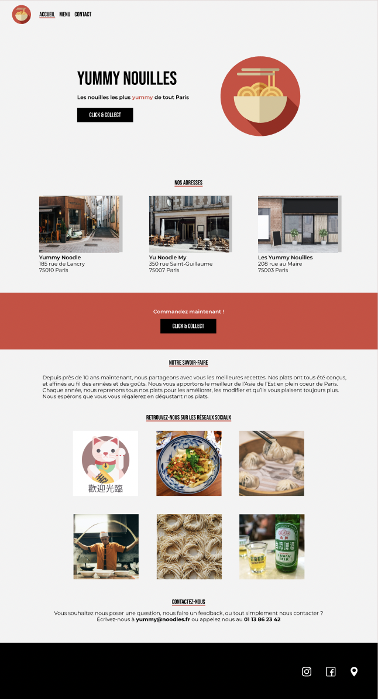

# 🍜 Yummy Nouilles

Intégration d'une maquette Figma (HTML/CSS)

Cours Openclassrooms:

- 1/ _[Créez une maquette avec Figma](https://openclassrooms.com/fr/courses/7342806-creez-une-maquette-web-avec-figma)_
- 2/ _[Intégrez une maquette Figma en HTML/CSS](https://openclassrooms.com/fr/courses/8242681-integrez-une-maquette-figma-en-html-css)_

## Color Reference

| Color         | Hex                                                              |
| ------------- | ---------------------------------------------------------------- |
| Red Highlight |  #d2483d |
| Grey Light    |  #f3f3f3 |
| White         |  #ffffff |
| Black         |  #000000 |

## Screenshots

**Accueil**

**Menu**

**Contact**

## Demo

[Voir le projet](https://jeremybzc.github.io/Integration-Yummy-Nouilles/)
